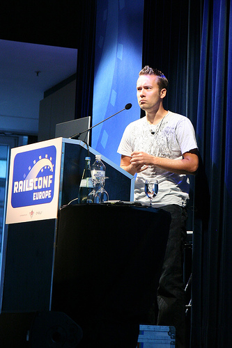
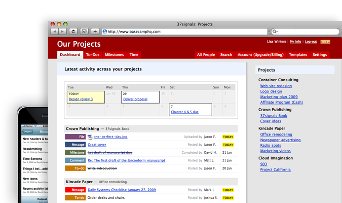

!SLIDE

# Cours de Ruby on Rails #

## Par Cyril Mougel ##
### cyril.mougel@gmail.com ###

!SLIDE

# Première release en 2004 #

!SLIDE center

# Créé par David Heinemeier Hansson « DHH » #

Image de <a rel="cc:attributionURL"     href="http://www.flickr.com/photos/62337512@N00/">Jesper Rønn-Jensen</a> <a rel="license" href="http://creativecommons.org/licenses/by/2.0/">(CC)</a>

!SLIDE center

# De la société 37 Signals #

!SLIDE center

# Extrait de BaseCamp #

!SLIDE

# En ruby car ... #

!SLIDE

# Possibilité d'introspection du code #

## User.find_by_name('hello') ##

!SLIDE center

# Une syntaxe simple #

    @@@ ruby
    class Project < ActiveRecord::Base
      has_many :users
    end

!SLIDE

# Le concept ? #

!SLIDE

# Concu pour les développeurs #
# Par les développeurs #

!SLIDE

# Un cadre de travail minimal #

!SLIDE

# Mais complet #

!SLIDE

# Uniquement pour faire du Web #

!SLIDE

# et que du web #

!SLIDE

# « Convention over Configuration » #

!SLIDE

# Moins on a de fichiers de configuration #

!SLIDE

# Moins on a de fichiers à éditer #

!SLIDE

# « Don't repeat Yourself » #

!SLIDE

# Arrêtons de copier/coller notre code #
# à d'autre endroit #

!SLIDE

# Un seul langage à apprendre #

!SLIDE

# Ruby on Rail est #
# MVC #

!SLIDE

# Model #
# View #
# Controller #

!SLIDE

# Le modèle ( Model ) #

!SLIDE

# Couche métier #

!SLIDE

# Correspondance avec les Bases de données #

!SLIDE

# Les vues ( Views ) #

!SLIDE

# La présentation HTML #

!SLIDE

# Juste du HTML #

!SLIDE

# Les controlleurs ( Controllers ) #

!SLIDE

# Dispatch les URL #

!SLIDE

# Une URL #
# == #
# Une action #

!SLIDE

# La documentation #

!SLIDE

# Le site officiel #
## [http://rubyonrails.org](http://rubyonrails.org)

!SLIDE

# L'API doc #
## [http://api.rubyonrails.org](http://api.rubyonrails.org)

!SLIDE

# Les guides #
## [http://guides.rubyonrails.org](http://guides.rubyonrails.org) ##

!SLIDE

# Le wiki #
## [http://wiki.rubyonrails.org](http://wiki.rubyonrails.org) ##

!SLIDE

# Un hierachie de fichier défini #

!SLIDE

# Chaque couche à sa place #

!SLIDE

# model #
# == #
# app/models #

!SLIDE

# view #
# == #
# app/views #

!SLIDE

# controller #
# == #
# app/controllers #

!SLIDE

# Un dossier de configuration #
# == #
# /config #

!SLIDE

# Un dossier de librairie #
# == #
# /lib #

!SLIDE

# Un seul fichier pour gérer les URL #

!SLIDE

# route.rb #

!SLIDE

# Une aide à la création #

!SLIDE commandline incremental

    $ rails my_app
      create
      create  app/controllers
      create  app/helpers
      create  app/models
      create  app/views/layouts
      create  config/environments
      create  config/initializers
      create  config/locales
      create  db
      create  doc
      create  lib
      create  lib/tasks
      create  log
      create  public/images
      create  public/javascripts
      create  public/stylesheets
      create  script/performance
      create  test/fixtures
      create  test/functional
      create  test/integration
      create  test/performance
      create  test/unit
      create  vendor
      create  vendor/plugins
      create  tmp/sessions
      create  tmp/sockets
      create  tmp/cache
      create  tmp/pids

!SLIDE commandline

    $ ...
      create  Rakefile
      create  README
      create  app/controllers/application_controller.rb
      create  app/helpers/application_helper.rb
      create  config/database.yml
      create  config/routes.rb
      create  config/locales/en.yml
      create  db/seeds.rb
      create  config/initializers/backtrace_silencers.rb
      create  config/initializers/inflections.rb
      create  config/initializers/mime_types.rb
      create  config/initializers/new_rails_defaults.rb
      create  config/initializers/session_store.rb
      create  config/environment.rb
      create  config/boot.rb
      create  config/environments/production.rb
      create  config/environments/development.rb
      create  config/environments/test.rb
      create  script/about
      create  script/console
      create  script/dbconsole
      create  script/destroy
      create  script/generate
      create  script/runner
      create  script/server
      create  script/plugin
      create  script/performance/benchmarker

!SLIDE commandline incremental

    $ ruby script/generate scaffold user name:string email:string
        exists  app/models/
        exists  app/controllers/
        exists  app/helpers/
        create  app/views/users
        exists  app/views/layouts/
        exists  test/functional/
        exists  test/unit/
        create  test/unit/helpers/
        exists  public/stylesheets/
        create  app/views/users/index.html.erb
        create  app/views/users/show.html.erb
        create  app/views/users/new.html.erb
        create  app/views/users/edit.html.erb
        create  app/views/layouts/users.html.erb
        create  public/stylesheets/scaffold.css
        create  app/controllers/users_controller.rb
        create  test/functional/users_controller_test.rb
        create  app/helpers/users_helper.rb
        create  test/unit/helpers/users_helper_test.rb
         route  map.resources :users
    dependency  model
        exists    app/models/
        exists    test/unit/
        exists    test/fixtures/
        create    app/models/user.rb
        create    test/unit/user_test.rb
        create    test/fixtures/users.yml
        create    db/migrate
        create    db/migrate/20100323142931_create_users.rb

